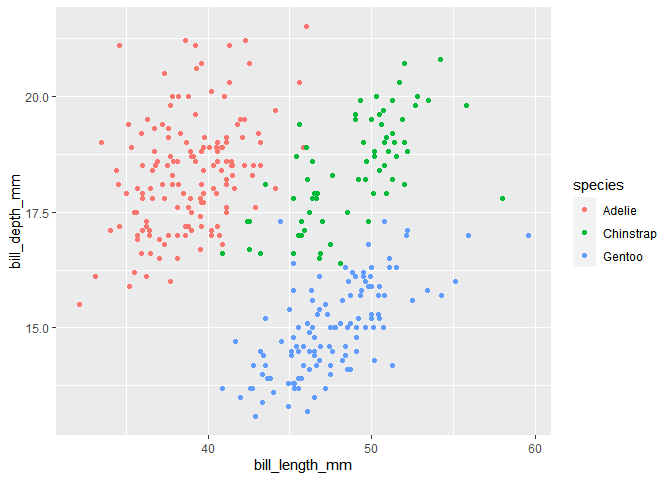
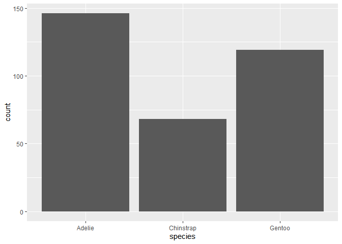
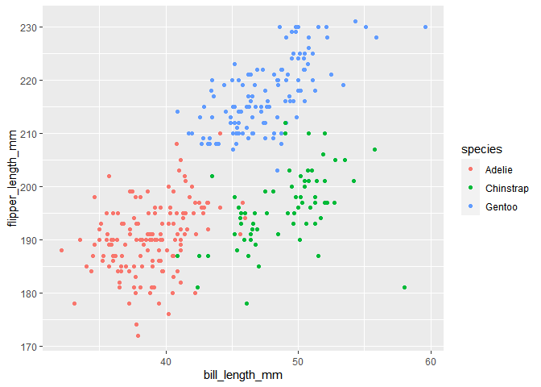

HW02
================
Tyler Allan
2/5/2021

``` r
library(gapminder)
library(tidyverse)
```

    ## -- Attaching packages --------------------------------------- tidyverse 1.3.0 --

    ## v ggplot2 3.3.3     v purrr   0.3.4
    ## v tibble  3.0.5     v dplyr   1.0.3
    ## v tidyr   1.1.2     v stringr 1.4.0
    ## v readr   1.4.0     v forcats 0.5.0

    ## -- Conflicts ------------------------------------------ tidyverse_conflicts() --
    ## x dplyr::filter() masks stats::filter()
    ## x dplyr::lag()    masks stats::lag()

``` r
library(ggplot2)
library(dplyr)
```

\#1.1 Use filter() to subset the gapminder data to three countries of
your choice in the 1970’s

``` r
acjminder <- gapminder %>% 
  filter(country %in% c("Afghanistan","Canada","Japan") & year > 1969 & year < 1980)
print(acjminder)
```

    ## # A tibble: 6 x 6
    ##   country     continent  year lifeExp       pop gdpPercap
    ##   <fct>       <fct>     <int>   <dbl>     <int>     <dbl>
    ## 1 Afghanistan Asia       1972    36.1  13079460      740.
    ## 2 Afghanistan Asia       1977    38.4  14880372      786.
    ## 3 Canada      Americas   1972    72.9  22284500    18971.
    ## 4 Canada      Americas   1977    74.2  23796400    22091.
    ## 5 Japan       Asia       1972    73.4 107188273    14779.
    ## 6 Japan       Asia       1977    75.4 113872473    16610.

\#1.2 Use the pipe operator to select “country” and “gdpPercap” from
your filtered dataset in 1.1

``` r
acjminder %>% 
  select(country, gdpPercap)
```

    ## # A tibble: 6 x 2
    ##   country     gdpPercap
    ##   <fct>           <dbl>
    ## 1 Afghanistan      740.
    ## 2 Afghanistan      786.
    ## 3 Canada         18971.
    ## 4 Canada         22091.
    ## 5 Japan          14779.
    ## 6 Japan          16610.

\#1.3 Make a new variable in gapminder for the change in life expectancy
from the previous measurement. Filter this table to show all of the
entries that have experienced a drop in life expectancy. Hint: you might
find the lag() and diff() functions useful.

``` r
deltalifeExp <- gapminder %>% 
  mutate(deltalifeExp = lag(lifeExp, order_by = year))
arrange(deltalifeExp, year)
```

    ## # A tibble: 1,704 x 7
    ##    country     continent  year lifeExp      pop gdpPercap deltalifeExp
    ##    <fct>       <fct>     <int>   <dbl>    <int>     <dbl>        <dbl>
    ##  1 Afghanistan Asia       1952    28.8  8425333      779.         NA  
    ##  2 Albania     Europe     1952    55.2  1282697     1601.         28.8
    ##  3 Algeria     Africa     1952    43.1  9279525     2449.         55.2
    ##  4 Angola      Africa     1952    30.0  4232095     3521.         43.1
    ##  5 Argentina   Americas   1952    62.5 17876956     5911.         30.0
    ##  6 Australia   Oceania    1952    69.1  8691212    10040.         62.5
    ##  7 Austria     Europe     1952    66.8  6927772     6137.         69.1
    ##  8 Bahrain     Asia       1952    50.9   120447     9867.         66.8
    ##  9 Bangladesh  Asia       1952    37.5 46886859      684.         50.9
    ## 10 Belgium     Europe     1952    68    8730405     8343.         37.5
    ## # ... with 1,694 more rows

``` r
deltalifeExp %>% 
  filter(deltalifeExp < lifeExp)
```

    ## # A tibble: 845 x 7
    ##    country     continent  year lifeExp      pop gdpPercap deltalifeExp
    ##    <fct>       <fct>     <int>   <dbl>    <int>     <dbl>        <dbl>
    ##  1 Afghanistan Asia       2007    43.8 31889923      975.         40.0
    ##  2 Albania     Europe     1952    55.2  1282697     1601.         28.8
    ##  3 Albania     Europe     1957    59.3  1476505     1942.         30.3
    ##  4 Albania     Europe     1962    64.8  1728137     2313.         32.0
    ##  5 Albania     Europe     1967    66.2  1984060     2760.         34.0
    ##  6 Albania     Europe     1972    67.7  2263554     3313.         36.1
    ##  7 Albania     Europe     1977    68.9  2509048     3533.         38.4
    ##  8 Albania     Europe     1982    70.4  2780097     3631.         39.9
    ##  9 Albania     Europe     1987    72    3075321     3739.         40.8
    ## 10 Albania     Europe     1992    71.6  3326498     2497.         41.7
    ## # ... with 835 more rows

\#1.4 Filter gapminder so that it shows the max GDP per capita
experienced by each country. Hint: you might find the max() function
useful here.

``` r
gapminder %>% 
  group_by(country) %>% 
  filter(gdpPercap %in% max(gdpPercap))
```

    ## # A tibble: 142 x 6
    ## # Groups:   country [142]
    ##    country     continent  year lifeExp       pop gdpPercap
    ##    <fct>       <fct>     <int>   <dbl>     <int>     <dbl>
    ##  1 Afghanistan Asia       1982    39.9  12881816      978.
    ##  2 Albania     Europe     2007    76.4   3600523     5937.
    ##  3 Algeria     Africa     2007    72.3  33333216     6223.
    ##  4 Angola      Africa     1967    36.0   5247469     5523.
    ##  5 Argentina   Americas   2007    75.3  40301927    12779.
    ##  6 Australia   Oceania    2007    81.2  20434176    34435.
    ##  7 Austria     Europe     2007    79.8   8199783    36126.
    ##  8 Bahrain     Asia       2007    75.6    708573    29796.
    ##  9 Bangladesh  Asia       2007    64.1 150448339     1391.
    ## 10 Belgium     Europe     2007    79.4  10392226    33693.
    ## # ... with 132 more rows

\#1.5 Produce a scatterplot of Canada’s life expectancy vs. GDP per
capita using ggplot2, without defining a new variable. That is, after
filtering the gapminder data set, pipe it directly into the ggplot
function. In your plot, put GDP per capita on a log scale.

``` r
gapminder %>% 
  filter(country == "Canada") %>% 
  ggplot() +
  aes(x = lifeExp,
      y = gdpPercap) +
  geom_point() + scale_y_log10()
```

<!-- -->

\#2.1 Pick two quantitative variables to explore. Make a table of
descriptive statistics for these variables using summarize (include
whatever statistics you feel appropriate). Make a scatterplot of these
variables using ggplot()

``` r
library(palmerpenguins)
palmerpenguins::penguins
```

    ## # A tibble: 344 x 8
    ##    species island bill_length_mm bill_depth_mm flipper_length_~ body_mass_g
    ##    <fct>   <fct>           <dbl>         <dbl>            <int>       <int>
    ##  1 Adelie  Torge~           39.1          18.7              181        3750
    ##  2 Adelie  Torge~           39.5          17.4              186        3800
    ##  3 Adelie  Torge~           40.3          18                195        3250
    ##  4 Adelie  Torge~           NA            NA                 NA          NA
    ##  5 Adelie  Torge~           36.7          19.3              193        3450
    ##  6 Adelie  Torge~           39.3          20.6              190        3650
    ##  7 Adelie  Torge~           38.9          17.8              181        3625
    ##  8 Adelie  Torge~           39.2          19.6              195        4675
    ##  9 Adelie  Torge~           34.1          18.1              193        3475
    ## 10 Adelie  Torge~           42            20.2              190        4250
    ## # ... with 334 more rows, and 2 more variables: sex <fct>, year <int>

``` r
penguin <- na.omit(penguins)
penguin
```

    ## # A tibble: 333 x 8
    ##    species island bill_length_mm bill_depth_mm flipper_length_~ body_mass_g
    ##    <fct>   <fct>           <dbl>         <dbl>            <int>       <int>
    ##  1 Adelie  Torge~           39.1          18.7              181        3750
    ##  2 Adelie  Torge~           39.5          17.4              186        3800
    ##  3 Adelie  Torge~           40.3          18                195        3250
    ##  4 Adelie  Torge~           36.7          19.3              193        3450
    ##  5 Adelie  Torge~           39.3          20.6              190        3650
    ##  6 Adelie  Torge~           38.9          17.8              181        3625
    ##  7 Adelie  Torge~           39.2          19.6              195        4675
    ##  8 Adelie  Torge~           41.1          17.6              182        3200
    ##  9 Adelie  Torge~           38.6          21.2              191        3800
    ## 10 Adelie  Torge~           34.6          21.1              198        4400
    ## # ... with 323 more rows, and 2 more variables: sex <fct>, year <int>

``` r
penguin %>% 
  summarize(meanl = mean(bill_length_mm),
            sdl = sd(bill_depth_mm),
            meand = mean(bill_length_mm),
            sdd = sd(bill_depth_mm),
  )
```

    ## # A tibble: 1 x 4
    ##   meanl   sdl meand   sdd
    ##   <dbl> <dbl> <dbl> <dbl>
    ## 1  44.0  1.97  44.0  1.97

``` r
    ggplot(penguins) +
      aes(x = bill_length_mm,
          y = bill_depth_mm) +
      geom_point()
```

    ## Warning: Removed 2 rows containing missing values (geom_point).

<!-- -->

\#2.2 Pick one categorical variable and one quantitative variable to
explore. Make a summary table giving the sample size (hint: n()) and
descriptive statistics for the quantitative variable by group. Make one
or more useful plots to visualize these variables.

``` r
penguin %>% 
  group_by(species) %>% 
  summarize(meangd = mean(bill_depth_mm),
            sdgd = sd(bill_depth_mm),
            meangl = mean(bill_length_mm),
            sdgl = sd(bill_length_mm),
            meangf = mean(flipper_length_mm),
            sdgf = sd(flipper_length_mm),
            n = n())
```

    ## # A tibble: 3 x 8
    ##   species   meangd  sdgd meangl  sdgl meangf  sdgf     n
    ## * <fct>      <dbl> <dbl>  <dbl> <dbl>  <dbl> <dbl> <int>
    ## 1 Adelie      18.3 1.22    38.8  2.66   190.  6.52   146
    ## 2 Chinstrap   18.4 1.14    48.8  3.34   196.  7.13    68
    ## 3 Gentoo      15.0 0.986   47.6  3.11   217.  6.59   119

``` r
  ggplot(penguin) +
      aes(x = bill_length_mm,
          y = bill_depth_mm,
          fill = species,
          color = species) +
      geom_point()
```

<!-- -->

``` r
  ggplot(penguin) +
    aes(x = species) +
   geom_bar()
```

<!-- -->

``` r
  ggplot(penguin) +
  aes(x = bill_length_mm,
      y = flipper_length_mm,
      fill = species,
      color = species) +
  geom_point()
```

<!-- -->
