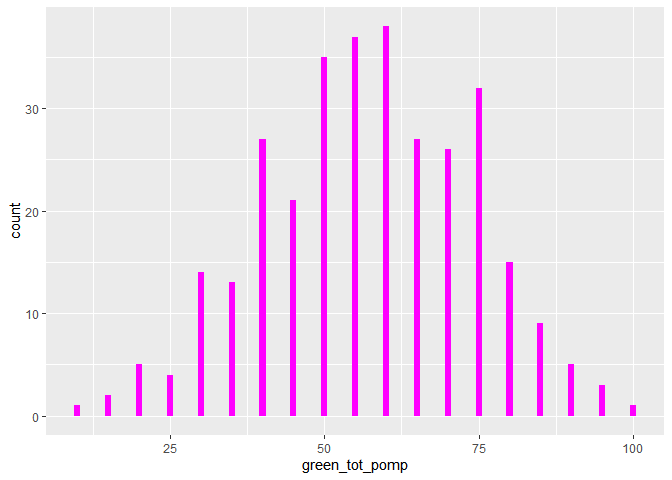
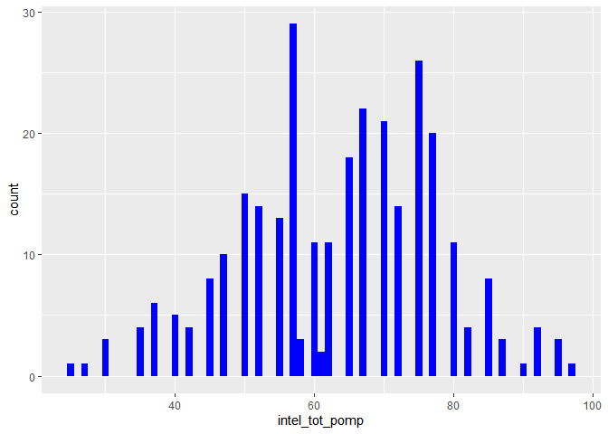
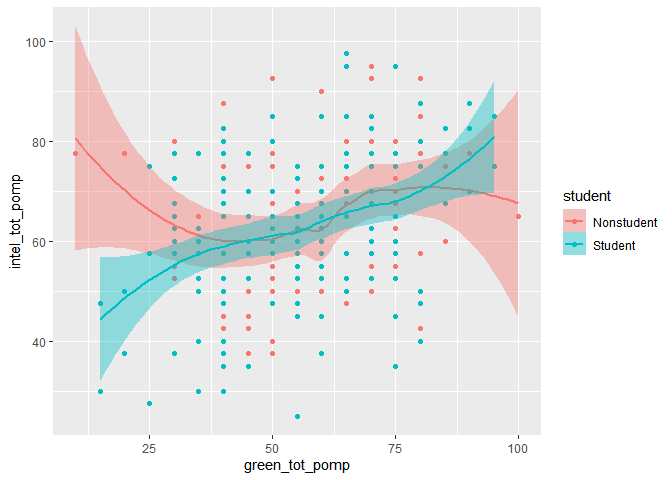

HW03
================
Tyler Allan
2/18/2021

# Homework 03

You will analyze data looking at the relationship between **green
reputation** and three personality traits–**compassion**, **intellectual
curiosity**, and **openness to experiences**. The dataset includes data
from **students** and **non-students**.

``` r
dictionary <- readr::read_csv("green_dictionary.csv")
```

    ## 
    ## -- Column specification --------------------------------------------------------
    ## cols(
    ##   Item = col_character(),
    ##   Content = col_character(),
    ##   Options = col_character(),
    ##   Keying = col_double()
    ## )

``` r
green_data <- readr::read_csv("green_data.csv")
```

    ## 
    ## -- Column specification --------------------------------------------------------
    ## cols(
    ##   .default = col_double(),
    ##   id = col_character()
    ## )
    ## i Use `spec()` for the full column specifications.

``` r
library(tidyverse)
```

    ## -- Attaching packages --------------------------------------- tidyverse 1.3.0 --

    ## v ggplot2 3.3.3     v purrr   0.3.4
    ## v tibble  3.0.5     v dplyr   1.0.3
    ## v tidyr   1.1.2     v stringr 1.4.0
    ## v readr   1.4.0     v forcats 0.5.0

    ## -- Conflicts ------------------------------------------ tidyverse_conflicts() --
    ## x dplyr::filter() masks stats::filter()
    ## x dplyr::lag()    masks stats::lag()

For your assignment, do the following.

1.  Inspect the item responses (e.g., with graphs or by summarizing
    distinct values). Is anything unusual?

``` r
print(green_data)
```

    ## # A tibble: 373 x 37
    ##    id    green1 green2 green3 green4 green5 comp1 comp2 comp3 comp4 comp5 comp6
    ##    <chr>  <dbl>  <dbl>  <dbl>  <dbl>  <dbl> <dbl> <dbl> <dbl> <dbl> <dbl> <dbl>
    ##  1 9099       4      2      5      4      3     2     5     4     4     2     2
    ##  2 6275       3      5      3      3      1     4     5     4     5     5     1
    ##  3 8116       4      2      5      4      3     4     5     5     4     5     1
    ##  4 8586       4      3      5      4      3     4     5     5     4     5     1
    ##  5 0406       3      2      4      4      4     4     4     4     4     4     2
    ##  6 5645       4      3      4      4      3     5     5     5     4     4     2
    ##  7 3788       1      1      1      1      1     3     3     3     3     3     3
    ##  8 8424       4      3      2      2      2     1     1     1     2     2     4
    ##  9 8450       4      2      3      5      2     4     4     4     4     4     1
    ## 10 0512       4      2      5      5      4     5     2     5     4     2     2
    ## # ... with 363 more rows, and 25 more variables: comp7 <dbl>, comp8 <dbl>,
    ## #   comp9 <dbl>, comp10 <dbl>, intel1 <dbl>, intel2 <dbl>, intel3 <dbl>,
    ## #   intel4 <dbl>, intel5 <dbl>, intel6 <dbl>, intel7 <dbl>, intel8 <dbl>,
    ## #   intel9 <dbl>, intel10 <dbl>, open1 <dbl>, open2 <dbl>, open3 <dbl>,
    ## #   open4 <dbl>, open5 <dbl>, open6 <dbl>, open7 <dbl>, open8 <dbl>,
    ## #   open9 <dbl>, open10 <dbl>, student <dbl>

``` r
summary(green_data$comp1)
```

    ##    Min. 1st Qu.  Median    Mean 3rd Qu.    Max.    NA's 
    ## -99.000   4.000   4.000   3.648   4.000   5.000      86

``` r
new_green_data <- green_data %>% 
                na_if("-99")
print(new_green_data)
```

    ## # A tibble: 373 x 37
    ##    id    green1 green2 green3 green4 green5 comp1 comp2 comp3 comp4 comp5 comp6
    ##    <chr>  <dbl>  <dbl>  <dbl>  <dbl>  <dbl> <dbl> <dbl> <dbl> <dbl> <dbl> <dbl>
    ##  1 9099       4      2      5      4      3     2     5     4     4     2     2
    ##  2 6275       3      5      3      3      1     4     5     4     5     5     1
    ##  3 8116       4      2      5      4      3     4     5     5     4     5     1
    ##  4 8586       4      3      5      4      3     4     5     5     4     5     1
    ##  5 0406       3      2      4      4      4     4     4     4     4     4     2
    ##  6 5645       4      3      4      4      3     5     5     5     4     4     2
    ##  7 3788       1      1      1      1      1     3     3     3     3     3     3
    ##  8 8424       4      3      2      2      2     1     1     1     2     2     4
    ##  9 8450       4      2      3      5      2     4     4     4     4     4     1
    ## 10 0512       4      2      5      5      4     5     2     5     4     2     2
    ## # ... with 363 more rows, and 25 more variables: comp7 <dbl>, comp8 <dbl>,
    ## #   comp9 <dbl>, comp10 <dbl>, intel1 <dbl>, intel2 <dbl>, intel3 <dbl>,
    ## #   intel4 <dbl>, intel5 <dbl>, intel6 <dbl>, intel7 <dbl>, intel8 <dbl>,
    ## #   intel9 <dbl>, intel10 <dbl>, open1 <dbl>, open2 <dbl>, open3 <dbl>,
    ## #   open4 <dbl>, open5 <dbl>, open6 <dbl>, open7 <dbl>, open8 <dbl>,
    ## #   open9 <dbl>, open10 <dbl>, student <dbl>

``` r
summary(new_green_data$green1)
```

    ##    Min. 1st Qu.  Median    Mean 3rd Qu.    Max.    NA's 
    ##   1.000   3.000   4.000   3.476   4.000   5.000      58

1.  Compute total scores for the four scales. Recode variables as
    needed.

``` r
reversed <- c("green2", "comp6", "comp7", "comp8", "comp9", "comp10", 
              "intel7", "intel8", "intel9", "intel10", "open7", "open8", 
              "open9", "open10")
new_green_datar <- new_green_data %>% 
                    mutate(
                           across(all_of(reversed),
                           ~ recode(.x, "1" = 5, "2" = 4, "4" = 2, "5" = 1),
                           .names = "{.col}r")
                          ) 

new_green_datar <- new_green_datar %>% 
  rowwise() %>% 
  mutate(green_tot = sum(c(green1,green2r,green3,green4,green5), na.rm = TRUE),
         comp_tot = sum(c(comp1,comp2,comp3,comp4,comp5,comp6r,comp7r,comp8r,comp9r,comp10r), na.rm = TRUE),
         intel_tot = sum(c(intel1,intel2,intel3,intel4,intel5,intel6,intel7r,intel8r,intel9r,intel10r), na.rm = TRUE),
         open_tot = sum(c(open1,open2,open3,open4,open5,open6,open7r,open8r,open9r,open10r), na.rm = TRUE),) 
```

1.  Rescale the variables so that they go from 0-100 instead of the
    original range. Name the rescaled variables `*_pomp`.

``` r
new_green_data_pomp <- new_green_datar %>% 
                    mutate(
                           across(c(green1:open10r),
                           ~ recode(.x, "1" = 0, "2" = 25, "3" = 50, "4" = 75, "5" = 100),
                           .names = "{.col}_pomp")
                          )
new_green_data_pomp <- new_green_data_pomp %>% 
  rowwise() %>% 
  mutate(green_tot_pomp = sum(c(green1_pomp,green2r_pomp,green3_pomp,green4_pomp,green5_pomp), na.rm = TRUE),
         comp_tot_pomp = sum(c(comp1_pomp,comp2_pomp,comp3_pomp,comp4_pomp,comp5_pomp,comp6r_pomp,comp7r_pomp,
                               comp8r_pomp,comp9r_pomp,comp10r_pomp), na.rm = TRUE),
         intel_tot_pomp = sum(c(intel1_pomp,intel2_pomp,intel3_pomp,intel4_pomp,intel5_pomp,intel6_pomp,intel7r_pomp,
                                intel8r_pomp,intel9r_pomp,intel10r_pomp), na.rm = TRUE),
         open_tot_pomp = sum(c(open1_pomp,open2_pomp,open3_pomp,open4_pomp,open5_pomp,open6_pomp,open7r_pomp,
                               open8r_pomp,open9r_pomp,open10r_pomp), na.rm = TRUE),) 
```

1.  Make plots that illustrate the distributions of the 4 POMP-scored
    variables.

``` r
ggplot(new_green_data_pomp[which(new_green_data_pomp$green_tot_pomp>0),]) +
  aes(x = green_tot_pomp) +
  geom_histogram(binwidth = 10)
```

<!-- -->

``` r
ggplot(new_green_data_pomp[which(new_green_data_pomp$comp_tot_pomp>0),]) +
  aes(x = comp_tot_pomp) +
  geom_histogram(binwidth = 10)
```

<!-- -->

``` r
ggplot(new_green_data_pomp[which(new_green_data_pomp$intel_tot_pomp>0),]) +
  aes(x = intel_tot_pomp) +
  geom_histogram(binwidth = 10)
```

<!-- -->

``` r
ggplot(new_green_data_pomp[which(new_green_data_pomp$open_tot_pomp>0),]) +
  aes(x = open_tot_pomp) +
  geom_histogram(binwidth = 10)
```

<!-- -->

# Description

Of the four pomp scored histograms only the green variable appears to be
normally distributed around the center of the score distribution. The
other three variables, open, intel, and comp appear to be skewed to the
left such that more people responded in the higher range across these
items.

1.  Make scatterplots showing the relationships between **green
    reputation** and each personality trait. Include trend lines for
    **students** and **non-students**. What do these plots show?

``` r
new_green_data_pomp <- new_green_data_pomp %>%
  mutate(
    student = recode(student, "1" = "Nonstudent", "2" = "Student")
  )

ggplot(na.omit(new_green_data_pomp)) +
  aes(x = green_tot_pomp,
      y = comp_tot_pomp,
      fill = student,
      color = student) +
  geom_point() +
  geom_point() +
  geom_smooth(data = subset(new_green_data_pomp, student == "Nonstudent"| student == "Student"))
```

    ## `geom_smooth()` using method = 'loess' and formula 'y ~ x'

<!-- -->

``` r
ggplot(na.omit(new_green_data_pomp)) +
  aes(x = green_tot_pomp,
      y = intel_tot_pomp,
      fill = student,
      color = student) +
  geom_point() +
  geom_point() +
  geom_smooth(data = subset(new_green_data_pomp, student == "Nonstudent"| student == "Student"))
```

    ## `geom_smooth()` using method = 'loess' and formula 'y ~ x'

<!-- -->

``` r
ggplot(na.omit(new_green_data_pomp)) +
  aes(x = green_tot_pomp,
      y = open_tot_pomp,
      fill = student,
      color = student) +
  geom_point() +
  geom_point() +
  geom_smooth(data = subset(new_green_data_pomp, student == "Nonstudent"| student == "Student"))
```

    ## `geom_smooth()` using method = 'loess' and formula 'y ~ x'

<!-- --> \# Description

The trend lines for green reputation across all three personality
variables appear to follow similar trends. Students low in green
reputation tend to score below the nonstudents on their personality
variables, but as green reputation scores increase, students tend to be
higher in their persoanlity variables than nonstudents.

1.  Compare **green reputation** for students and non-students using a
    **rainfall plot** (bar + density + data points).

``` r
ggplot(na.omit(new_green_data_pomp)) +
  aes(y = student,
      x = green_tot_pomp,
      fill = student,
      color = student) +
  geom_jitter(height = .15) +
  geom_boxplot(color = "black",
               alpha = .5,
               width = .1,
               size = .5) +
  ggdist::stat_slab(height = .3,
                    color = "black",
                    size = .2,
                    alpha = .5,
                    position = position_nudge(y = .2))
```

<!-- --> \# Description

Based on the rainfall plot, nonstudents appear to have a slightly higher
average green reputation than students. The data for students is
slightly more varied around the mean than that for the nonstudents.

1.  Compute a summary table of means, SDs, medians, minima, and maxima
    for the four total scores for students and non-students.

``` r
new_green_data_pomp %>% 
  group_by(student) %>% 
  summarize(mean_green = mean(green_tot_pomp),
            sd_green = sd(green_tot_pomp),
            median_green = median(green_tot_pomp),
            min_green = min(green_tot_pomp),
            max_green = max(green_tot_pomp),
            mean_comp = mean(comp_tot_pomp),
            sd_comp = sd(comp_tot_pomp),
            median_comp = median(comp_tot_pomp),
            min_comp = min(comp_tot_pomp),
            max_comp = max(comp_tot_pomp),
            mean_intel = mean(intel_tot_pomp),
            sd_intel = sd(intel_tot_pomp),
            median_intel = median(intel_tot_pomp),
            min_intel = min(intel_tot_pomp),
            max_intel = max(intel_tot_pomp),
            mean_open = mean(open_tot_pomp),
            sd_open = sd(open_tot_pomp),
            median_open = median(open_tot_pomp),
            min_open = min(open_tot_pomp),
            max_open = max(open_tot_pomp),)
```

    ## # A tibble: 3 x 21
    ##   student mean_green sd_green median_green min_green max_green mean_comp sd_comp
    ## * <chr>        <dbl>    <dbl>        <dbl>     <dbl>     <dbl>     <dbl>   <dbl>
    ## 1 Nonstu~       293.     82.5          300        50       500     702.     141.
    ## 2 Student       282.     85.5          275        75       475     772.     147.
    ## 3 <NA>          112.    148.             0         0       450      82.0    195.
    ## # ... with 13 more variables: median_comp <dbl>, min_comp <dbl>,
    ## #   max_comp <dbl>, mean_intel <dbl>, sd_intel <dbl>, median_intel <dbl>,
    ## #   min_intel <dbl>, max_intel <dbl>, mean_open <dbl>, sd_open <dbl>,
    ## #   median_open <dbl>, min_open <dbl>, max_open <dbl>

# Description

Nonstudents had a higher mean with less deviation from the mean than
students in their green reputation data. Nonstudents also had a higher
mean intel score than students. Students had higher means on comp and
open variables. Additionally the standard deviation for students on
these variables was higher than that for nonstudents as well. Maximum
and minimum scores across the variables tended to be similar with many
of the maximums and minimums matching for both nonstudents and students
such as for max comp and open as well. The medians for both students and
nonstudents also tended to be very similar to one another.

In your assignment, prepare an RMarkdown file that includes both the
coding and (for 4-7) narrative descriptions of your results.
